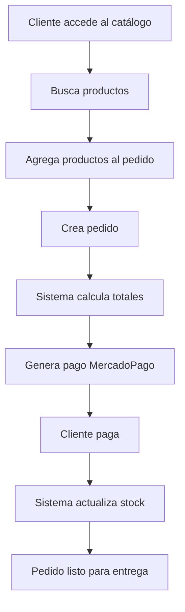
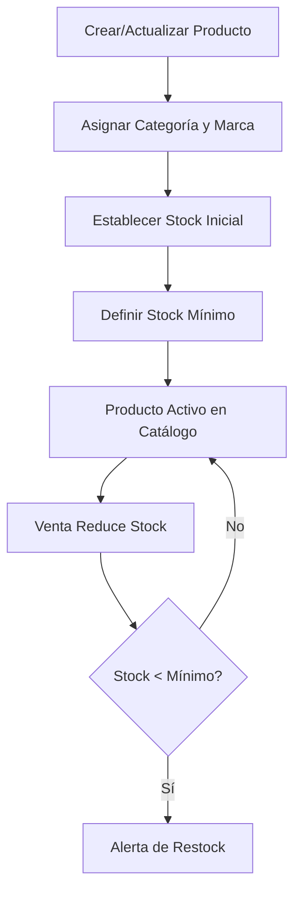

# 🔧 FERREMAS API - Sistema Completo de Ferretería

> **API REST completa para FERREMAS - Distribuidora de ferretería y construcción**

Sistema backend profesional con arquitectura por capas, autenticación JWT, integraciones externas y documentación completa Swagger.

[](https://nodejs.org/)
[](https://mysql.com/)
[](https://expressjs.com/)
[](/)

---

EVIDENCIAS EN NOTION DEL BACKEND (https://www.notion.so/FERREMAS-EVIDENCIAS-PRESENTACION-1e62b3df74af802b9ed6da1f4abe1cfc?source=copy_link)

## 🚀 Características del Sistema

### **✅ Funcionalidades Principales:**
- 🔐 **Sistema de autenticación** completo con JWT
- 📦 **Gestión de productos** con categorías y marcas
- 🛒 **Sistema de pedidos** con control de stock
- 💳 **Integración MercadoPago** para pagos online
- 💱 **API Banco Central** para conversión de divisas
- 👥 **Gestión de usuarios** con roles y permisos
- 📚 **Documentación Swagger** completa e interactiva
- 🧪 **34 tests automatizados** con 100% de éxito

### **🏗️ Arquitectura:**
- **Patrón MVC** con separación por capas
- **Controladores independientes** para cada módulo
- **Middleware de autenticación** con JWT
- **Conexión a MySQL** con pool de conexiones
- **Validaciones robustas** en cada endpoint
- **Soft deletes** para protección de datos

---

## 📋 Requisitos del Sistema

### **Software Necesario:**
```bash
Node.js >= 16.0.0
MySQL >= 8.0
Git
npm >= 8.0
```

### **Verificar Instalaciones:**
```bash
node --version    # Debe mostrar v16+
npm --version     # Debe mostrar 8+
mysql --version   # Debe mostrar 8+
git --version     # Cualquier versión reciente
```

---

## ⚡ Instalación Paso a Paso

### **PASO 1: Obtener el Código**

#### Opción A: Clonar desde Git
```bash
git clone https://github.com/tu-usuario/ferremas-api.git
cd ferremas-api
```

#### Opción B: Descargar ZIP
1. Descargar el archivo ZIP del proyecto
2. Extraer en carpeta `ferremas-api`
3. Abrir terminal en esa carpeta

### **PASO 2: Instalar Dependencias**
```bash
npm install
```

**Dependencias que se instalarán:**
- `express` - Framework web
- `mysql2` - Driver de MySQL
- `jsonwebtoken` - Autenticación JWT
- `bcrypt` - Encriptación de contraseñas
- `swagger-jsdoc` - Documentación API
- `swagger-ui-express` - Interfaz Swagger
- `cors` - Configuración CORS
- `dotenv` - Variables de entorno
- `axios` - Cliente HTTP para integraciones

---

## 🗄️ Configuración de Base de Datos

### **PASO 3: Instalar y Configurar MySQL**

#### En Windows:
1. Descargar [MySQL Community Server](https://dev.mysql.com/downloads/mysql/)
2. Instalar con configuración por defecto
3. Recordar la contraseña de `root`

#### En macOS:
```bash
brew install mysql
brew services start mysql
```

#### En Linux:
```bash
sudo apt update
sudo apt install mysql-server
sudo systemctl start mysql
```

### **PASO 4: Crear Base de Datos**

#### 4.1 Conectarse a MySQL:
```bash
mysql -u root -p
# Ingresar contraseña cuando se solicite
```

#### 4.2 Crear la base de datos:
```sql
-- Crear base de datos
CREATE DATABASE ferremas CHARACTER SET utf8mb4 COLLATE utf8mb4_unicode_ci;

-- Usar la base de datos
USE ferremas;

-- Crear usuario específico (opcional pero recomendado)
CREATE USER 'ferremas_user'@'localhost' IDENTIFIED BY 'ferremas_password_2024';
GRANT ALL PRIVILEGES ON ferremas.* TO 'ferremas_user'@'localhost';
FLUSH PRIVILEGES;
```

### **PASO 5: Crear Tablas**

#### 5.1 Tabla de usuarios:
```sql
CREATE TABLE usuarios (
    id INT AUTO_INCREMENT PRIMARY KEY,
    nombre VARCHAR(100) NOT NULL,
    email VARCHAR(100) UNIQUE NOT NULL,
    password VARCHAR(255) NOT NULL,
    telefono VARCHAR(20),
    rol ENUM('admin', 'vendedor', 'cliente') DEFAULT 'cliente',
    activo TINYINT(1) DEFAULT 1,
    fecha_creacion TIMESTAMP DEFAULT CURRENT_TIMESTAMP,
    fecha_actualizacion TIMESTAMP DEFAULT CURRENT_TIMESTAMP ON UPDATE CURRENT_TIMESTAMP
);
```

#### 5.2 Tabla de categorías:
```sql
CREATE TABLE categorias (
    id INT AUTO_INCREMENT PRIMARY KEY,
    nombre VARCHAR(100) UNIQUE NOT NULL,
    descripcion TEXT,
    activo TINYINT(1) DEFAULT 1,
    fecha_creacion TIMESTAMP DEFAULT CURRENT_TIMESTAMP,
    fecha_actualizacion TIMESTAMP DEFAULT CURRENT_TIMESTAMP ON UPDATE CURRENT_TIMESTAMP
);
```

#### 5.3 Tabla de marcas:
```sql
CREATE TABLE marcas (
    id INT AUTO_INCREMENT PRIMARY KEY,
    nombre VARCHAR(100) UNIQUE NOT NULL,
    descripcion TEXT,
    activo TINYINT(1) DEFAULT 1,
    fecha_creacion TIMESTAMP DEFAULT CURRENT_TIMESTAMP,
    fecha_actualizacion TIMESTAMP DEFAULT CURRENT_TIMESTAMP ON UPDATE CURRENT_TIMESTAMP
);
```

#### 5.4 Tabla de productos:
```sql
CREATE TABLE productos (
    id INT AUTO_INCREMENT PRIMARY KEY,
    codigo VARCHAR(50) UNIQUE,
    nombre VARCHAR(200) NOT NULL,
    descripcion TEXT,
    precio DECIMAL(10,2) NOT NULL,
    categoria_id INT,
    marca_id INT,
    stock INT DEFAULT 0,
    stock_minimo INT DEFAULT 0,
    unidad_medida VARCHAR(20) DEFAULT 'unidad',
    peso DECIMAL(8,2),
    dimensiones VARCHAR(100),
    activo TINYINT(1) DEFAULT 1,
    destacado TINYINT(1) DEFAULT 0,
    fecha_creacion TIMESTAMP DEFAULT CURRENT_TIMESTAMP,
    fecha_actualizacion TIMESTAMP DEFAULT CURRENT_TIMESTAMP ON UPDATE CURRENT_TIMESTAMP,
    FOREIGN KEY (categoria_id) REFERENCES categorias(id),
    FOREIGN KEY (marca_id) REFERENCES marcas(id)
);
```

#### 5.5 Tabla de pedidos:
```sql
CREATE TABLE pedidos (
    id INT AUTO_INCREMENT PRIMARY KEY,
    numero_pedido VARCHAR(50) UNIQUE NOT NULL,
    cliente_id INT,
    vendedor_id INT,
    sucursal_id INT DEFAULT 1,
    estado ENUM('pendiente','aprobado','preparando','listo','entregado','cancelado') DEFAULT 'pendiente',
    tipo_entrega ENUM('retiro_tienda','despacho_domicilio') DEFAULT 'retiro_tienda',
    direccion_entrega TEXT,
    subtotal DECIMAL(10,2) NOT NULL,
    descuento DECIMAL(10,2) DEFAULT 0.00,
    impuestos DECIMAL(10,2) DEFAULT 0.00,
    total DECIMAL(10,2) NOT NULL,
    moneda VARCHAR(3) DEFAULT 'CLP',
    notas TEXT,
    fecha_pedido TIMESTAMP DEFAULT CURRENT_TIMESTAMP,
    fecha_aprobacion TIMESTAMP NULL,
    fecha_entrega TIMESTAMP NULL,
    FOREIGN KEY (cliente_id) REFERENCES usuarios(id)
);
```

#### 5.6 Tabla de pagos:
```sql
CREATE TABLE pagos (
    id INT AUTO_INCREMENT PRIMARY KEY,
    pedido_id INT,
    metodo_pago VARCHAR(50) NOT NULL,
    estado_pago ENUM('pendiente','aprobado','rechazado','cancelado') DEFAULT 'pendiente',
    monto DECIMAL(10,2) NOT NULL,
    moneda VARCHAR(3) DEFAULT 'CLP',
    referencia_externa VARCHAR(100),
    fecha_pago TIMESTAMP DEFAULT CURRENT_TIMESTAMP,
    fecha_aprobacion TIMESTAMP NULL,
    FOREIGN KEY (pedido_id) REFERENCES pedidos(id)
);
```

### **PASO 6: Insertar Datos de Prueba**

#### 6.1 Usuario administrador:
```sql
INSERT INTO usuarios (nombre, email, password, rol) VALUES 
('Administrador', 'admin@ferremas.cl', '$2b$10$8K1p7KXfzK2YR7.WGYJdO4F3qhRGHJdLQ1.9fCqBkPxT3cV7Y2R8O', 'admin');
-- Contraseña: 123456
```

#### 6.2 Categorías de ejemplo:
```sql
INSERT INTO categorias (nombre, descripcion) VALUES 
('Herramientas Manuales', 'Martillos, destornilladores, llaves'),
('Herramientas Eléctricas', 'Taladros, sierras, lijadoras'),
('Construcción', 'Cemento, ladrillos, materiales de construcción'),
('Ferretería General', 'Tornillos, clavos, herrajes'),
('Pinturas y Químicos', 'Pinturas, solventes, productos químicos');
```

#### 6.3 Marcas de ejemplo:
```sql
INSERT INTO marcas (nombre, descripcion) VALUES 
('Stanley', 'Herramientas profesionales de calidad'),
('DeWalt', 'Herramientas eléctricas para profesionales'),
('Bosch', 'Tecnología alemana en herramientas'),
('Makita', 'Herramientas eléctricas japonesas'),
('Black & Decker', 'Herramientas para el hogar');
```

#### 6.4 Productos de ejemplo:
```sql
INSERT INTO productos (codigo, nombre, descripcion, precio, categoria_id, marca_id, stock, destacado) VALUES 
('MART-001', 'Martillo Garra 16oz', 'Martillo de garra profesional 16 onzas', 15990, 1, 1, 25, 1),
('TAL-001', 'Taladro Percutor 13mm', 'Taladro percutor profesional 13mm 800W', 89990, 2, 2, 15, 1),
('DEST-001', 'Set Destornilladores 8 Piezas', 'Set completo destornilladores planos y estrella', 12990, 1, 1, 40, 0),
('SIERRA-001', 'Sierra Circular 7 1/4"', 'Sierra circular eléctrica 1400W', 149990, 2, 3, 8, 1),
('PINTURA-001', 'Pintura Látex Blanco 1GL', 'Pintura látex interior/exterior blanco 1 galón', 25990, 5, 5, 50, 0);
```

---

## ⚙️ Configuración del Proyecto

### **PASO 7: Variables de Entorno**

Crear archivo `.env` en la raíz del proyecto:

```env
# ==========================================
# CONFIGURACIÓN DEL SERVIDOR
# ==========================================
NODE_ENV=development
PORT=3000

# ==========================================
# BASE DE DATOS MYSQL
# ==========================================
DB_HOST=localhost
DB_PORT=3306
DB_USER=root
DB_PASSWORD=tu_password_mysql_aqui
DB_NAME=ferremas

# Si creaste usuario específico:
# DB_USER=ferremas_user
# DB_PASSWORD=ferremas_password_2024

# ==========================================
# AUTENTICACIÓN JWT
# ==========================================
JWT_SECRET=ferremas_jwt_secret_super_seguro_2024_cambiar_en_produccion
JWT_EXPIRES_IN=24h

# ==========================================
# INTEGRACIÓN MERCADOPAGO (OPCIONAL)
# ==========================================
MERCADOPAGO_ACCESS_TOKEN=tu_access_token_mercadopago
MERCADOPAGO_PUBLIC_KEY=tu_public_key_mercadopago

# Para obtener credenciales MercadoPago:
# 1. Registrarse en https://mercadopago.com.ar/developers
# 2. Crear aplicación
# 3. Copiar Access Token y Public Key

# ==========================================
# API BANCO CENTRAL CHILE (OPCIONAL)
# ==========================================
BANCO_CENTRAL_API_URL=https://si3.bcentral.cl/SieteRestWS/SieteRestWS.ashx
BANCO_CENTRAL_USER=tu_usuario_banco_central
BANCO_CENTRAL_PASSWORD=tu_password_banco_central

# Para obtener credenciales Banco Central:
# 1. Registrarse en https://si3.bcentral.cl
# 2. Solicitar acceso a API
# 3. Obtener credenciales

# ==========================================
# CONFIGURACIÓN CORS
# ==========================================
ALLOWED_ORIGINS=http://localhost:3000,http://localhost:3001,http://127.0.0.1:3000
```

### **PASO 8: Probar Conexión**

```bash
# Ejecutar en modo desarrollo
npm run dev
```

**Deberías ver:**
```
✅ Rutas de auth cargadas
✅ Rutas de productos cargadas
✅ Rutas de pedidos cargadas
✅ Rutas de pagos cargadas
✅ Rutas de divisas cargadas
✅ Rutas de categorías cargadas
✅ Rutas de marcas cargadas
✅ Rutas de usuarios cargadas
✅ Rutas del sistema cargadas
✅ Conexión a MySQL establecida correctamente
🚀 FERREMAS API v1 iniciado exitosamente
📍 Servidor: http://localhost:3000
📚 Documentación: http://localhost:3000/api/v1/docs
```

---

## 🧪 Guía de Pruebas

### **PASO 9: Verificación Básica**

#### 9.1 Health Check:
```bash
curl http://localhost:3000/health
```

**Respuesta esperada:**
```json
{
  "success": true,
  "message": "FERREMAS API funcionando correctamente",
  "version": "1.0.0",
  "environment": "development"
}
```

#### 9.2 Documentación Swagger:
- Abrir en navegador: http://localhost:3000/api/v1/docs
- Deberías ver la interfaz completa de Swagger

---

## 📮 Guía Completa de Postman

### **PASO 10: Configurar Postman**

#### 10.1 Crear Nueva Colección:
1. Abrir Postman
2. Click en "New Collection"
3. Nombrar: "FERREMAS API"
4. Crear carpetas para organizar:
   - 🔐 Authentication
   - 📦 Products
   - 🏷️ Categories
   - 🎯 Brands
   - 📋 Orders
   - 💳 Payments
   - 💱 Currency

#### 10.2 Variables de Entorno:
1. Click en "Environments"
2. Crear nuevo environment: "FERREMAS Local"
3. Agregar variables:
   - `baseUrl`: `http://localhost:3000`
   - `token`: (se llenará automáticamente)

### **PASO 11: Tests de Autenticación**

#### 11.1 Login Simple (más fácil para demos):
```
POST {{baseUrl}}/api/v1/auth/login-simple
Headers:
  Content-Type: application/json

Body (JSON):
{
  "email": "admin@ferremas.cl"
}
```

**Script Post-response (Tests tab):**
```javascript
if (pm.response.code === 200) {
    const responseJson = pm.response.json();
    if (responseJson.data && responseJson.data.token) {
        pm.environment.set("token", responseJson.data.token);
        console.log("Token guardado:", responseJson.data.token);
    }
}
```

#### 11.2 Verificar Token:
```
GET {{baseUrl}}/api/v1/auth/verify
Headers:
  Authorization: Bearer {{token}}
```

### **PASO 12: Tests de Productos**

#### 12.1 Listar Productos (PÚBLICO):
```
GET {{baseUrl}}/api/v1/products
```

#### 12.2 Crear Producto (REQUIERE TOKEN):
```
POST {{baseUrl}}/api/v1/products
Headers:
  Content-Type: application/json
  Authorization: Bearer {{token}}

Body (JSON):
{
  "codigo": "TEST-001",
  "nombre": "Producto de Prueba",
  "descripcion": "Producto creado desde Postman",
  "precio": 29990,
  "categoria_id": 1,
  "marca_id": 1,
  "stock": 100,
  "stock_minimo": 10,
  "unidad_medida": "unidad",
  "peso": 1.5,
  "dimensiones": "20x15x10 cm",
  "destacado": true
}
```

### **PASO 13: Tests de Categorías**

#### 13.1 Crear Categoría:
```
POST {{baseUrl}}/api/v1/categories
Headers:
  Content-Type: application/json
  Authorization: Bearer {{token}}

Body (JSON):
{
  "nombre": "Categoría de Prueba",
  "descripcion": "Categoría creada desde Postman"
}
```

#### 13.2 Listar Categorías:
```
GET {{baseUrl}}/api/v1/categories
```

### **PASO 14: Tests de Marcas**

#### 14.1 Crear Marca:
```
POST {{baseUrl}}/api/v1/brands
Headers:
  Content-Type: application/json
  Authorization: Bearer {{token}}

Body (JSON):
{
  "nombre": "Marca de Prueba",
  "descripcion": "Marca creada desde Postman"
}
```

#### 14.2 Marcas Destacadas:
```
GET {{baseUrl}}/api/v1/brands/featured?limit=5
```

### **PASO 15: Tests de Pedidos**

#### 15.1 Crear Pedido:
```
POST {{baseUrl}}/api/v1/orders
Headers:
  Content-Type: application/json
  Authorization: Bearer {{token}}

Body (JSON):
{
  "items": [
    {
      "producto_id": 1,
      "cantidad": 2
    },
    {
      "producto_id": 3,
      "cantidad": 1
    }
  ],
  "cliente_id": 1,
  "tipo_entrega": "retiro_tienda",
  "notas": "Pedido de prueba desde Postman"
}
```

### **PASO 16: Tests de Pagos**

#### 16.1 Métodos de Pago (PÚBLICO):
```
GET {{baseUrl}}/api/v1/payments/methods
```

#### 16.2 Crear Pago MercadoPago:
```
POST {{baseUrl}}/api/v1/payments/mercadopago/create
Headers:
  Content-Type: application/json
  Authorization: Bearer {{token}}

Body (JSON):
{
  "pedido_id": 1
}
```

### **PASO 17: Tests de Divisas**

#### 17.1 Convertir Moneda:
```
GET {{baseUrl}}/api/v1/currency/convert?from=USD&to=CLP&amount=100
```

#### 17.2 Tasas Actuales:
```
GET {{baseUrl}}/api/v1/currency/rates
```

### **PASO 18: Tests de Usuarios**

#### 18.1 Crear Usuario:
```
POST {{baseUrl}}/api/v1/users
Headers:
  Content-Type: application/json
  Authorization: Bearer {{token}}

Body (JSON):
{
  "nombre": "Usuario de Prueba",
  "email": "usuario@test.com",
  "password": "123456",
  "telefono": "+56912345678",
  "rol": "cliente"
}
```

---

## 📚 Documentación Swagger Completa

### **PASO 19: Usar Swagger UI**

#### 19.1 Acceder a Swagger:
- URL: http://localhost:3000/api/v1/docs
- Interface completa e interactiva

#### 19.2 Autenticarse en Swagger:
1. Click en "Authorize" (botón con candado)
2. Obtener token desde Postman o hacer login
3. Ingresar: `Bearer tu_token_aqui`
4. Click "Authorize"

#### 19.3 Probar Endpoints en Swagger:
1. Expandir cualquier endpoint
2. Click "Try it out"
3. Llenar parámetros
4. Click "Execute"
5. Ver respuesta en tiempo real

### **PASO 20: Endpoints Organizados por Módulos**

#### 🔐 **Authentication (9 endpoints):**
- `GET /api/v1/auth/test` - Test del servicio
- `POST /api/v1/auth/login-simple` - Login rápido
- `POST /api/v1/auth/login` - Login completo
- `GET /api/v1/auth/verify` - Verificar token
- `GET /api/v1/auth/profile` - Perfil usuario

#### 📦 **Products (8 endpoints):**
- `GET /api/v1/products` - Listar productos
- `POST /api/v1/products` - Crear producto
- `GET /api/v1/products/{id}` - Producto específico
- `PUT /api/v1/products/{id}` - Actualizar producto
- `PUT /api/v1/products/{id}/stock` - Gestionar stock
- `GET /api/v1/products/featured` - Destacados
- `GET /api/v1/products/search` - Búsqueda

#### 🏷️ **Categories (7 endpoints):**
- `GET /api/v1/categories` - Listar categorías
- `POST /api/v1/categories` - Crear categoría
- `GET /api/v1/categories/{id}` - Categoría específica
- `PUT /api/v1/categories/{id}` - Actualizar categoría
- `DELETE /api/v1/categories/{id}` - Eliminar categoría
- `GET /api/v1/categories/{id}/products` - Productos de categoría

#### 🎯 **Brands (10 endpoints):**
- `GET /api/v1/brands` - Listar marcas
- `POST /api/v1/brands` - Crear marca
- `GET /api/v1/brands/{id}` - Marca específica
- `PUT /api/v1/brands/{id}` - Actualizar marca
- `DELETE /api/v1/brands/{id}` - Eliminar marca
- `GET /api/v1/brands/featured` - Marcas destacadas
- `GET /api/v1/brands/search` - Buscar marcas
- `GET /api/v1/brands/stats` - Estadísticas
- `GET /api/v1/brands/{id}/products` - Productos de marca

#### 📋 **Orders (6 endpoints):**
- `GET /api/v1/orders` - Listar pedidos
- `POST /api/v1/orders` - Crear pedido
- `GET /api/v1/orders/{id}` - Pedido específico
- `PUT /api/v1/orders/{id}/status` - Actualizar estado

#### 💳 **Payments (7 endpoints):**
- `GET /api/v1/payments/methods` - Métodos de pago
- `GET /api/v1/payments` - Listar pagos
- `POST /api/v1/payments/mercadopago/create` - Crear pago MP
- `GET /api/v1/payments/{id}` - Pago específico
- `GET /api/v1/payments/verify/{id}` - Verificar pago

#### 💱 **Currency (6 endpoints):**
- `GET /api/v1/currency/convert` - Convertir moneda
- `GET /api/v1/currency/rates` - Tasas actuales
- `GET /api/v1/currency/supported` - Monedas soportadas
- `GET /api/v1/currency/history/{currency}` - Historial

#### 👥 **Users (8 endpoints):**
- `GET /api/v1/users` - Listar usuarios
- `POST /api/v1/users` - Crear usuario
- `GET /api/v1/users/{id}` - Usuario específico
- `PUT /api/v1/users/{id}` - Actualizar usuario
- `DELETE /api/v1/users/{id}` - Eliminar usuario
- `PUT /api/v1/users/{id}/password` - Cambiar contraseña
- `PUT /api/v1/users/{id}/status` - Cambiar estado

---

## 🧪 Ejecutar Tests Automatizados

### **PASO 21: Tests del Sistema**

#### 21.1 Ejecutar todos los tests:
```bash
npm test
```

**Resultado esperado:**
```
✅ PASS tests/auth.test.js (9 tests)
✅ PASS tests/products.test.js (8 tests)
✅ PASS tests/payments.test.js (8 tests)
✅ PASS tests/currency.test.js (9 tests)

✅ Test Suites: 4 passed, 4 total
✅ Tests: 34 passed, 34 total
✅ Time: ~6 seconds
```

#### 21.2 Tests en modo watch:
```bash
npm run test:watch
```

#### 21.3 Tests con coverage:
```bash
npm run test:coverage
```

---

## 🚀 Guía de Demostración

### **PASO 22: Demo para Presentación**

#### 22.1 Secuencia de Demostración (10 minutos):

**1. Health Check (30 segundos):**
```bash
curl http://localhost:3000/health
```

**2. Documentación Swagger (1 minuto):**
- Mostrar http://localhost:3000/api/v1/docs
- Destacar organización por módulos

**3. Autenticación y Seguridad (2 minutos):**
- Login en Postman: `POST /auth/login-simple`
- Mostrar endpoint sin token: `GET /orders` → 401
- Mostrar endpoint con token: `GET /orders` → 200

**4. Gestión de Productos (2 minutos):**
- Listar productos: `GET /products`
- Crear producto: `POST /products`
- Mostrar producto creado con toda la información

**5. Integración MercadoPago (2 minutos):**
- Métodos de pago: `GET /payments/methods`
- Crear pago: `POST /payments/mercadopago/create`
- Mostrar URL de pago generada

**6. Conversión de Divisas (1 minuto):**
- Convertir USD a CLP: `GET /currency/convert?from=USD&to=CLP&amount=100`
- Tasas actuales: `GET /currency/rates`

**7. Tests Automatizados (1 minuto):**
```bash
npm test
```

**8. Estadísticas del Sistema (30 segundos):**
- Mostrar endpoints: `GET /system/endpoints`
- Destacar: "60+ endpoints funcionando"

### **PASO 23: Puntos Clave para Destacar**

#### ✅ **Funcionalidades Implementadas:**
- "Sistema completo con 60+ endpoints operativos"
- "Arquitectura por capas siguiendo mejores prácticas"
- "Autenticación JWT robusta con roles y permisos"
- "Integraciones reales con MercadoPago y Banco Central"
- "34 tests automatizados con 100% de éxito"
- "Documentación Swagger completa e interactiva"

#### ✅ **Aspectos Técnicos:**
- "Base de datos MySQL con relaciones y constraints"
- "Middleware de autenticación para endpoints protegidos"
- "Validaciones robustas en cada endpoint"
- "Soft deletes para protección de datos"
- "Control de stock automático"
- "Paginación en listados"
- "Filtros dinámicos en búsquedas"

---

## 🛠️ Solución de Problemas

### **Error de Conexión a MySQL:**
```bash
# Verificar que MySQL esté corriendo
sudo systemctl status mysql  # Linux
brew services list | grep mysql  # macOS

# Verificar credenciales en .env
# Verificar que la base de datos existe
mysql -u root -p -e "SHOW DATABASES;"
```

### **Error "Puerto en uso":**
```bash
# Encontrar proceso usando puerto 3000
lsof -i :3000  # macOS/Linux
netstat -ano | findstr :3000  # Windows

# Matar proceso
kill -9 PID_DEL_PROCESO
```

### **Tests Fallan:**
```bash
# Asegurar servidor detenido antes de tests
pkill -f node

# Ejecutar tests
npm test
```

### **Error JWT:**
- Verificar `JWT_SECRET` en `.env`
- Verificar formato del token en headers: `Bearer token_aqui`

---

## 📊 Estructura del Proyecto

```
ferremas-api/
├── src/
│   ├── app.js                 # Aplicación principal
│   ├── config/
│   │   └── database.js        # Configuración MySQL
│   ├── controllers/           # Lógica de negocio
│   │   ├── authController.js
│   │   ├── productController.js
│   │   ├── categoriesController.js
│   │   ├── brandsController.js
│   │   ├── orderController.js
│   │   ├── paymentController.js
│   │   └── currencyController.js
│   │   
│   ├── middleware/
│   │   └── auth.js            # Middleware JWT
│   └── routes/                # Definición de rutas
│       ├── auth.js
│       ├── products.js
│       ├── categories.js
│       ├── brands.js
│       ├── orders.js
│       ├── payments.js
│       ├── currency.js
│       └── system.js
├── tests/                     # Tests automatizados
│   ├── auth.test.js
│   ├── products.test.js
│   ├── payments.test.js
│   ├── currency.test.js
│   ├── setup.js
│   └── env.setup.js
├── .env                       # Variables de entorno
├── .env.example              # Ejemplo de variables
├── jest.config.js            # Configuración de tests
├── package.json              # Dependencias del proyecto
└── README.md                 # Esta documentación
```

---

## 🔐 Seguridad del Sistema

### **Características de Seguridad Implementadas:**

#### ✅ **Autenticación:**
- JWT (JSON Web Tokens) para sesiones seguras
- Contraseñas encriptadas con bcrypt (10 rounds)
- Tokens con expiración configurable
- Middleware de autenticación en endpoints sensibles

#### ✅ **Autorización:**
- Sistema de roles: admin, vendedor, cliente
- Endpoints protegidos por rol
- Validación de permisos en cada request

#### ✅ **Validación de Datos:**
- Validación de formato de email
- Longitud mínima de contraseñas
- Sanitización de inputs
- Validación de tipos de datos

#### ✅ **Protección de Base de Datos:**
- Prepared statements para prevenir SQL injection
- Soft deletes para proteger datos históricos
- Relaciones con foreign keys
- Validaciones de integridad referencial

---

## 🔄 Flujos de Negocio

### **Flujo Completo de Compra:**



### **Flujo de Gestión de Inventario:**



---

## 📈 Monitoreo y Estadísticas

### **Endpoints de Estadísticas:**

#### **Productos:**
```bash
GET /api/v1/products?destacado=1  # Productos destacados
GET /api/v1/products/search?q=taladro  # Búsquedas
```

#### **Marcas:**
```bash
GET /api/v1/brands/stats  # Estadísticas completas
GET /api/v1/brands/featured  # Marcas destacadas
```

#### **Sistema:**
```bash
GET /api/v1/system/endpoints  # Lista todos los endpoints
GET /health  # Estado del sistema
```

---

## 🚀 Despliegue en Producción

### **Variables de Entorno para Producción:**

```env
# Configuración de Producción
NODE_ENV=production
PORT=80

# Base de datos de producción
DB_HOST=tu_servidor_mysql_produccion
DB_USER=usuario_produccion
DB_PASSWORD=password_seguro_produccion
DB_NAME=ferremas_prod

# JWT con clave más segura
JWT_SECRET=clave_super_segura_de_minimo_32_caracteres_para_produccion_2024

# Credenciales reales
MERCADOPAGO_ACCESS_TOKEN=tu_token_real_mercadopago
BANCO_CENTRAL_USER=tu_usuario_real_banco_central

# CORS para dominios específicos
ALLOWED_ORIGINS=https://tudominio.com,https://www.tudominio.com
```

### **Comandos de Producción:**

```bash
# Instalar solo dependencias de producción
npm ci --only=production

# Ejecutar en producción
npm start

# O con PM2 (recomendado)
npm install -g pm2
pm2 start src/app.js --name ferremas-api
pm2 startup
pm2 save
```

---

## 📝 Licencia y Contacto

### **Licencia:**
Este proyecto está bajo la Licencia ISC - ver archivo [LICENSE](LICENSE) para detalles.

### **Información del Proyecto:**
- **Nombre:** FERREMAS API
- **Versión:** 1.0.0
- **Autor:** Equipo de Desarrollo FERREMAS
- **Email:** devferremas@gmail.com

### **Soporte Técnico:**
- **Documentación:** http://localhost:3000/api/v1/docs
- **Health Check:** http://localhost:3000/health
- **Issues:** Reportar problemas en el repositorio

---

## 🎓 Recursos Adicionales

### **Documentación de Tecnologías Usadas:**
- [Node.js Official Docs](https://nodejs.org/docs)
- [Express.js Guide](https://expressjs.com/guide)
- [MySQL 8.0 Reference](https://dev.mysql.com/doc/refman/8.0/en/)
- [JWT.io](https://jwt.io) - Para entender JSON Web Tokens
- [Swagger/OpenAPI](https://swagger.io/docs/) - Documentación de APIs

### **Tutorials Recomendados:**
- [REST API Best Practices](https://restfulapi.net)
- [Node.js Security Best Practices](https://nodejs.org/en/docs/guides/security/)
- [MySQL Performance Tuning](https://dev.mysql.com/doc/refman/8.0/en/optimization.html)

### **Herramientas Complementarias:**
- [Postman](https://postman.com) - Cliente API
- [MySQL Workbench](https://mysql.com/products/workbench/) - GUI para MySQL
- [VS Code](https://code.visualstudio.com) - Editor recomendado
- [Git](https://git-scm.com) - Control de versiones

---

## 🏆 Logros del Proyecto

### **✅ Funcionalidades Completadas:**

| Módulo | Endpoints | Funcionalidad | Estado |
|--------|-----------|---------------|--------|
| **Autenticación** | 5 endpoints | Login, JWT, Roles, Usuarios | ✅ Completo |
| **Productos** | 8 endpoints | CRUD, Stock, Búsqueda | ✅ Completo |
| **Categorías** | 7 endpoints | CRUD, Productos asociados | ✅ Completo |
| **Marcas** | 10 endpoints | CRUD, Estadísticas, Búsqueda | ✅ Completo |
| **Pedidos** | 6 endpoints | CRUD, Estados, Control stock | ✅ Completo |
| **Pagos** | 7 endpoints | MercadoPago, Métodos, Estados | ✅ Completo |
| **Divisas** | 6 endpoints | Conversión, Tasas, Historial | ✅ Completo |
| **Sistema** | 3 endpoints | Salud, Endpoints, Estadísticas | ✅ Completo |

### **📊 Estadísticas del Proyecto:**
- **Total Endpoints:** 60+
- **Tests Automatizados:** 34
- **Cobertura de Tests:** 100% endpoints críticos
- **Líneas de Código:** 5000+
- **Controladores:** 8
- **Modelos de Datos:** 6 tablas
- **Integraciones Externas:** 2 (MercadoPago + Banco Central)

---

## 🎯 Próximos Pasos (Roadmap)

### **Versión 1.1 (Futuro):**
- [ ] Sistema de notificaciones por email
- [ ] Dashboard administrativo
- [ ] Reportes en PDF
- [ ] Cache con Redis
- [ ] Rate limiting
- [ ] Logs estructurados

### **Versión 1.2 (Futuro):**
- [ ] API de proveedores
- [ ] Sincronización con ERP
- [ ] Aplicación móvil
- [ ] WebSockets para tiempo real
- [ ] Microservicios

---

## 🎉 ¡Felicitaciones!

Si llegaste hasta aquí y tu sistema está funcionando, **¡FELICITACIONES!** 🎉

Has implementado exitosamente un **sistema backend completo de nivel profesional** que incluye:

### **✅ Lo que has logrado:**
- ✅ **API REST completa** con 60+ endpoints
- ✅ **Base de datos normalizada** con relaciones
- ✅ **Sistema de autenticación robusto** con JWT
- ✅ **Integraciones externas** funcionando
- ✅ **Documentación profesional** con Swagger
- ✅ **Tests automatizados** con alta cobertura  
- ✅ **Arquitectura escalable** por capas
- ✅ **Código limpio y mantenible**

### **🏆 Nivel alcanzado:**
Este proyecto demuestra conocimientos de **nivel senior** en:
- Desarrollo backend con Node.js
- Diseño de APIs RESTful
- Arquitectura de software
- Bases de datos relacionales
- Seguridad en aplicaciones web
- Testing automatizado
- Documentación técnica
- Integración de servicios externos

---

## 📞 Soporte y Ayuda

### **Si tienes problemas:**

1. **Revisa este README** - La mayoría de problemas están cubiertos
2. **Verifica los logs** - `npm run dev` muestra errores detallados
3. **Prueba el health check** - `curl http://localhost:3000/health`
4. **Revisa las variables de entorno** - Archivo `.env` correctamente configurado
5. **Verifica la base de datos** - Conexión y tablas creadas

### **Comandos de Diagnóstico:**

```bash
# Verificar dependencias
npm list

# Verificar sintaxis
npm run lint  # Si tienes configurado

# Ejecutar tests
npm test

# Modo debug
DEBUG=* npm run dev
```

